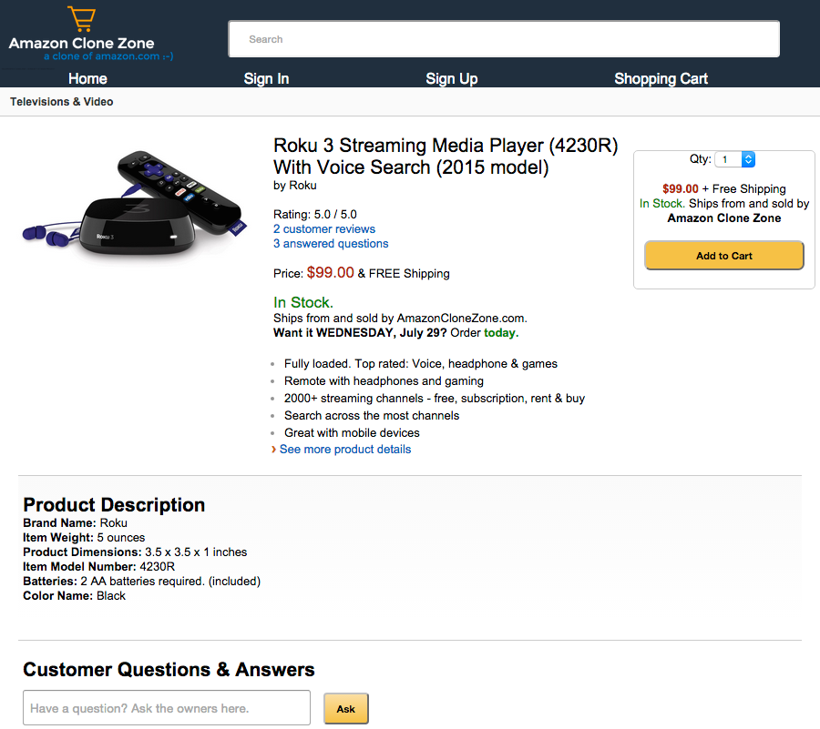

# [AmazonCloneZone.com](http://amazonclonezone.com)

Amazon Clone Zone is a single-page Backbone application inspired by Amazon.com.

[Check it out live!](http://amazonclonezone.com)

## Languages
- JavaScript
- Ruby
- HTML / CSS

## Frameworks
- Backbone
- Rails

## Technologies
- jQuery / AJAX
- jbuilder
- Underscore.js

## Highlights
- Single page Backbone application built on a RESTful JSON Rails API
- Custom user authentication system using BCrypt
- Custom jbuilder templates to ensure only necessary and appropriate resources are supplied from server to client
- Replication of server-side Active Record Associations into the client-side (i.e. Backbone).  Done via:
  - Custom Backbone association methods
  - Overridden Backbone `parse` method
- Collections of models within views are rendered via subviews availing users with greater functionality and flexibility
- Custom validations for various forms (e.g. sign-up, sign-in, products reviews)

## Features

### User Authentication and Authorization
- Custom user authentication via BCrypt overrides `User#password=` method to store secret hash in database in lieu of plain text
- Users may browse most of AmazonCloneZone.com and its features without signing in
- User authentication enforced for various actions:
  - Users are not permitted to checkout items or place orders without identifying themselves via authentication
- User authorization enforced for various other actions:
  - Users are not permitted to view orders not belonging to themselves
  - Users may not create or update models (e.g. product questions, answers, and reviews) that do not belong to their user account.

### Shopping Cart
- User may add products to their shopping cart even when not signed in
- Users' shopping carts are persisted to database and indefinitely retain any items placed within them
- Custom `merge_carts` method to merge shopping carts in instances where users inadvertently create multiple carts between separate sessions
  - e.g. User begins shopping while signed out and then signs into an account that already has a persisted shopping cart

### Products
Users may:
- Browse various products
- View product information (e.g. description, specifications, etc.)
- Choose quantity of products to place in shopping cart
- Destroy (i.e. delete) items from shopping cart
- Checkout and create orders
- View order history

### Discussions
Users have the ability to:
- Ask questions about products on individual product pages
- Answer other users' questions about products and leave comments
- Create product reviews for other users to reference

## Future Todos
- [x] Add ability for users to ask and answer product questions
- [ ] Permit third-party authentication through the real Amazon.com
- [ ] Enable users to upload and attach images to customer reviews
- [ ] Add search capabilities so users can find products by keyword(s)
- [ ] Make design responsive to different screen sizes via CSS
